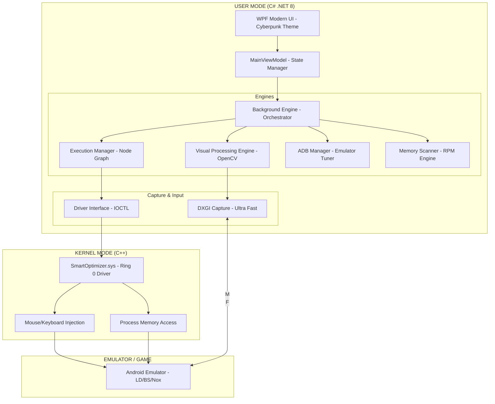

---

# 📑 SmartOptimizer Ultimate (AIM/OPT Pro v3.0) - Master Technical Documentation

## 🚀 ১. প্রজেক্টের লক্ষ্য ও ভিশন (Project Mission & Vision)
**SmartOptimizer Ultimate** হলো একটি নেক্সট-জেনারেশন উইন্ডোজ অ্যাপ্লিকেশন, যা অ্যান্ড্রয়েড এমুলেটর ব্যবহারকারীদের জন্য তৈরি। এর মূল লক্ষ্য হলো এমুলেটরের ল্যাগ দূর করা, পারফরম্যান্স সর্বোচ্চ পর্যায়ে নিয়ে যাওয়া এবং কালার/ইমেজ ও মেমোরি প্রসেসিংয়ের মাধ্যমে গেমপ্লেতে অতি-মানবিক সুবিধা প্রদান করা। এটি সম্পূর্ণ **Stealth** এবং **Anti-Cheat Resistant** ভাবে ডিজাইন করা।

---

## 🏗️ ২. হাই-লেভেল সিস্টেম আর্কিটেকচার (System Architecture Diagram)



---

## 📂 ৩. বিস্তারিত প্রজেক্ট স্ট্রাকচার (Full Project Tree)

```text
SmartOptimizer_Ultimate/
│
├── 📁 SmartOptimizer.UI/                   # WPF UI Project
│   ├── 📁 Assets/                          # Icons, Neon Fonts, Shaders
│   ├── 📁 Components/                      
│   │   ├── NodeCanvas.xaml                 # Visual Macro Designer
│   │   ├── OverlayHUD.xaml                 # In-game Floating Overlay
│   │   └── TerminalControl.xaml            # Live Log Console
│   ├── 📁 ViewModels/                      
│   │   ├── MainViewModel.cs                # Core Logic Binder
│   │   └── NodeViewModel.cs                # Visual Logic Flow
│   └── 📁 Views/                           
│       ├── DashboardPage.xaml              # Performance & ADB
│       └── MacroStudioPage.xaml            # Blueprint Editor
│
├── 📁 SmartOptimizer.Core/                 # Core Engine (DLL)
│   ├── 📁 Subsystems/
│   │   ├── ADBManager.cs                   # Port scanning & FPS injection
│   │   ├── ScreenCapture.cs                # DXGI & GDI++ Logic
│   │   ├── VisualEngine.cs                 # OpenCV Processing
│   │   ├── MemoryScanner.cs                # RPM / Pattern Scanning
│   │   └── ProcessOptimizer.cs             # CPU Affinity/Priority
│   ├── 📁 Execution/
│   │   ├── GraphNavigator.cs               # Logic traversal
│   │   └── ActionDispatcher.cs             # Input trigger
│   └── 📁 Security/
│       ├── DriverClient.cs                 # Communication with .sys
│       └── AntiDebug.cs                    # Detects if being analyzed
│
├── 📁 SmartOptimizer.Driver/               # C++ Kernel Driver
│   ├── 📁 Include/
│   │   ├── Driver.h                        # IOCTL & Definitions
│   │   └── Memory.h                        # Kernel Read/Write
│   └── 📁 Source/
│       ├── Main.cpp                        # Entry Point
│       └── Mouse.cpp                       # Stealth Movement Logic
│
├── 📁 SmartOptimizer.Presets/              # JSON Config Files
│   ├── Global.json                         # App settings
│   └── Profiles/                           # Game-specific macros
│
└── 🛠️ SmartOptimizer.sln                    # Visual Studio Solution
```

---

## ⚙️ ৪. মডিউল ভিত্তিক বিস্তারিত বিবরণ (Core Subsystems)

### ৪.১. পারফরম্যান্স অপ্টিমাইজেশন ইঞ্জিন (Performance Tuner)
এটি এমুলেটরের ল্যাগ কমানোর জন্য সরাসরি উইন্ডোজ কার্নেল এবং অ্যান্ড্রয়েড প্রসেসে ইন্টারফেয়ার করে।
*   **CPU Affinity Locking:** এমুলেটরকে নির্দিষ্ট হাই-পারফরম্যান্স কোরগুলোতে (যেমন Core 2, 4, 6) লক করে দেয় যাতে থ্রেড জাম্পিং না হয়।
*   **Working Set Trimmer:** মেমরি থেকে অপ্রয়োজনীয় ক্যাশ ডাটা প্রতি ১ মিনিট অন্তর ক্লিন করে।
*   **ADB FPS Unlocker:** এমুলেটরের ভেতরে `settings put system peak_refresh_rate 144` কমান্ডের মাধ্যমে সর্বোচ্চ ফ্রেমরেট ফোর্স করে।

### ৪.২. DXGI স্ক্রিন ক্যাপচার ইঞ্জিন (Ultra-Low Latency)
সাধারণ স্ক্রিনশট মেথড অত্যন্ত স্লো। আমরা ব্যবহার করছি **DirectX Graphics Infrastructure (DXGI)**।
*   **কিভাবে কাজ করে:** এটি সরাসরি জিপিইউ ফ্রেমবাফার থেকে ফ্রেম কপি করে।
*   **সুবিধা:** ০-১ মিলি-সেকেন্ড ল্যাটেন্সি। এটি ৬০+ এফপিএস-এ স্ক্রিন এনালাইসিস করতে সক্ষম।
*   **FallBack:** যদি জিপিইউ না থাকে, তবে এটি অপ্টিমাইজড GDI মেথড ব্যবহার করবে।

### ৪.৩. ভিজ্যুয়াল নোড গ্রাফ এক্সিকিউটর (Blueprint Studio)
তুমি যেমন "Scratch" বা "Unreal Blueprint" এর কথা বললে, এখানে ইউজার ড্র্যাগ-অ্যান্ড-ড্রপ করে লজিক তৈরি করবে।
*   **Node Types:**
    1.  **Event Node:** (যেমন: Hotkey Pressed, Color Found).
    2.  **Condition Node:** (যেমন: If Color > 80% Match).
    3.  **Action Node:** (যেমন: Move Mouse, Send ADB Tap, Delay).
    4.  **Logic Node:** (যেমন: Loop, Random Wait, Branch).

### ৪.৪. মেমরি স্ক্যানার ও আরপিএম ইঞ্জিন (Advanced ESP)
এটি একটি অত্যন্ত শক্তিশালী ফিচার যা ভবিষ্যতে যোগ করা হবে।
*   **RPM (ReadProcessMemory):** গেমের র‍্যাম থেকে সরাসরি ডেটা রিড করা।
*   **Stealth Memory Reading:** সরাসরি উইন্ডোজ এপিআই ব্যবহার না করে কার্নেল ড্রাইভারের মাধ্যমে মেমরি রিড করা, যাতে অ্যান্টি-চিট ডিটেক্ট করতে না পারে।
*   **Data Archiving:** স্ক্যান করা সব তথ্য একটি স্ট্রাকচারড ফোল্ডারে সেভ রাখা যাতে পরে অফলাইনে এনালাইসিস করা যায়।

---

## 🛡️ ৫. স্টিলথ ও বাইপাস টেকনিক (Stealth & Anti-Cheat Countermeasures)

গেম যেন আমাদের টুলটি ধরতে না পারে তার জন্য আমরা বিশেষ ৩টি লেয়ার ব্যবহার করব:

1.  **Kernel Driver Input (Ring 0):** গেমগুলো সাধারণত ইউজার মোড ইনপুট (যেমন `mouse_event`) ব্লক করে। আমাদের ড্রাইভার সরাসরি মাউস পোর্টের আই/ও রিকোয়েস্ট সিমুলেট করবে। এটি উইন্ডোজের চোখে একটি ফিজিক্যাল মাউস মুভমেন্ট।
2.  **Process Spoofing:** আমাদের মেইন `.exe` ফাইলটির নাম এবং আইকন র্যান্ডমাইজ করা যাবে। এটি নিজেকে "Calculator.exe" বা "Notepad.exe" হিসেবে জাহির করতে পারবে।
3.  **OverLay Transparency:** আমাদের ওভারলে উইন্ডোটি গেমের ড্র-কলের সাথে যুক্ত থাকবে না। এটি একটি আলাদা এক্সটার্নাল লেয়ার যা গেমের রেন্ডারিং পাইপলাইনে কোনো সিগনেচার ফেলে না।

---

## 🎯 ৬. প্রিডিক্টিভ এইম ক্যালকুলেশন (The Advanced Physics Logic)

তুমি যেটা জানতে চেয়েছিলে—এনিমি মুভ করলে কিভাবে টার্গেট করবে। এর জন্য আমরা **Linear Extrapolation** অ্যালগরিদম ব্যবহার করব।

**উদাহরণ:**
১. **ফ্রেম ১:** এনিমি পজিশন (X1, Y1) সময় T1 এ।
২. **ফ্রেম ২:** এনিমি পজিশন (X2, Y2) সময় T2 এ।
৩. **ক্যালকুলেশন:** বেগ (Velocity) = (দূরত্ব / সময়)।
৪. **ভবিষ্যদ্বাণী:** যদি আপনার পিং বা ল্যাটেন্সি ২০ মিলি-সেকেন্ড হয়, তবে এনিমি ২০ মিলি-সেকেন্ড পরে কোথায় থাকবে তা এই সূত্র দিয়ে বের করা হবে:
   `Predicted_X = X2 + (Velocity_X * Future_Time)`
৫. **অ্যাকশন:** মাউসকে সরাসরি (X2) তে না নিয়ে (Predicted_X) তে নেওয়া হবে। ফলে যখন গুলিটি পৌঁছাবে, তখন এনিমি ঠিক সেই জায়গায় থাকবে। একেই বলে **"Predictive Aiming"**।

---

## 🖥️ ৭. ইউজার ইন্টারফেস ডিজাইন (UI/UX Concepts)

*   **থিম:** Cyberpunk 2077 স্টাইল (Dark background with Neon Green and Electric Blue accents)।
*   **হটকি রেকর্ডার:** একটি ইন্টারঅ্যাক্টিভ বক্স থাকবে যেখানে ক্লিক করে যেকোনো কী চাপলে সেটি অটো-সেভ হবে।
*   **স্মার্ট ইনভিজিবিলিটি:** `CTRL+ALT+H` চাপলে অ্যাপটি টাস্কবার থেকে গায়েব হয়ে যাবে এবং সিস্টেম ট্রে-তে একটি ফেক আইকন (যেমন: Volume Icon) হিসেবে থাকবে।

---

## 🗺️ ৮. ডেভেলপমেন্ট রোডম্যাপ (Future Roadmap)

| ফেজ | সময়কাল | মূল লক্ষ্য |
| :--- | :--- | :--- |
| **Phase 1: Foundation** | ২-৩ সপ্তাহ | UI, Emulator Detection, ADB Manager, DXGI Capture |
| **Phase 2: Macro Studio** | ৪ সপ্তাহ | Visual Node Canvas, Logic Execution, OpenCV integration |
| **Phase 3: Kernel Stealth** | ৩ সপ্তাহ | C++ Driver Development, Mouse Injection, Anti-Cheat Bypass |
| **Phase 4: Intelligence** | ৫ সপ্তাহ | Memory Scanner, ESP Overlay, Predictive Aiming Logic |
| **Phase 5: Release** | ২ সপ্তাহ | Optimization, Installer creation, Global Preset Cloud |

---

## 🛠️ ৯. সিস্টেম প্রম্পট (AI Builder এর জন্য)

যখন তুমি কোনো AI এজেন্টকে প্রজেক্টটি তৈরি করতে বলবে, তখন নিচের এই প্রম্পটটি ব্যবহার করবে:

> "Build a high-performance Windows application using C# .NET 8 WPF. The project is an Emulator Optimizer and Automation Suite. Integrate DXGI for screen capture, OpenCvSharp4 for image processing, and a C++ Kernel Driver interface for mouse input. Implement a node-based visual macro system (similar to Blueprint) where users can connect nodes for 'Color Search' -> 'If Found' -> 'Move Mouse'. The UI should be a dark neon cyberpunk theme. Ensure modular architecture where the Driver, Core Logic, and UI are in separate projects."

---

## 📝 ১০. উপসংহার ও ডেভেলপার নোট
এই প্রজেক্টটি শুধুমাত্র একটি কোডিং প্রজেক্ট নয়, এটি একটি **Engineering Masterpiece**। এর প্রতিটি মডিউল (যেমন মেমরি রিডিং বা স্ক্রিন ক্যাপচার) স্বাধীনভাবে কাজ করবে। ফলে ভবিষ্যতে যদি কোনো গেম আপডেট হয়, তবে তোমাকে পুরো সফটওয়্যার পরিবর্তন করতে হবে না, শুধু নির্দিষ্ট মডিউল আপডেট করলেই হবে।

---

